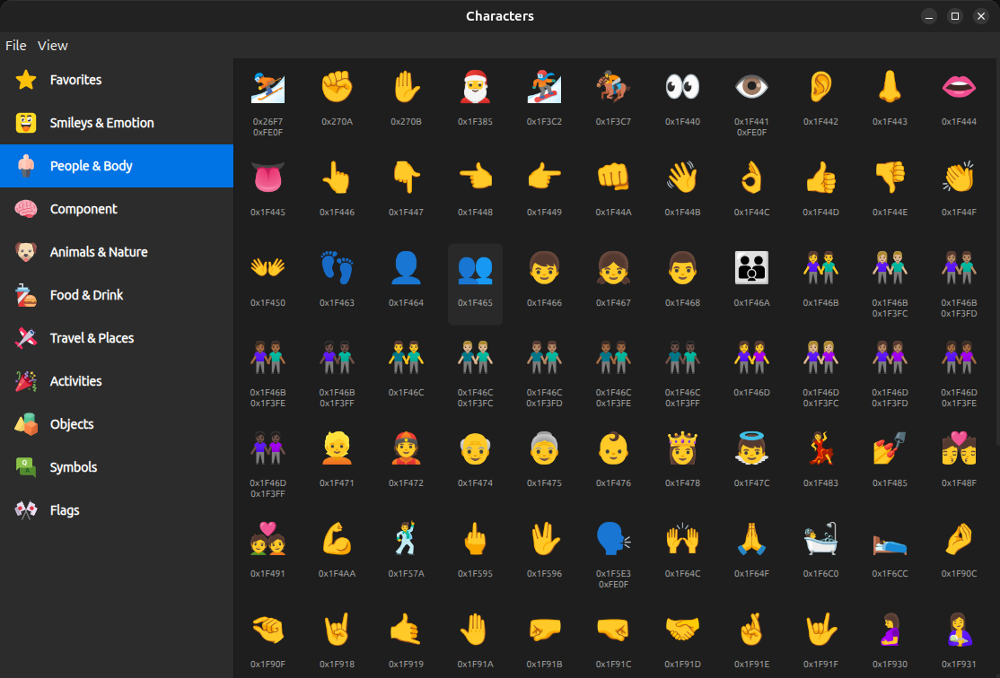

# Unicode Symbols

A program for viewing all Unicode characters, including emojis and character combinations, and control symbols.

[https://unicode.org/charts/](https://unicode.org/charts/)

# References

- Latest version of Unicode characters database - [Unicode Character Database](https://www.unicode.org/Public/UCD/latest)
- All block ranges - [Blocks.txt](https://www.unicode.org/Public/UCD/latest/ucd/Blocks.txt)
- Unicode main database - [UnicodeData.txt](https://www.unicode.org/Public/UCD/latest/ucd/UnicodeData.txt)
- Emoji Database - [emoji-test.txt](https://www.unicode.org/Public/UCD/latest/emoji/emoji-test.txt)
